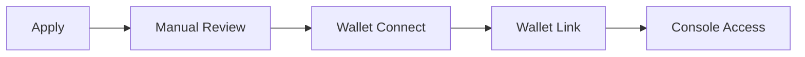

<div align="center">


# ZKGent

### Confidential payments, engineered for Solana.

Private by design. Verifiable by mathematics. Settled at Solana speed.

[](https://github.com/zkgent/ZKGent)
[](https://zkgent.sbs/trust-model)
[](https://explorer.solana.com/?cluster=devnet)
[](https://zkgent.sbs/apply)

[Website](https://zkgent.sbs) · [Docs](https://zkgent.sbs/docs) · [Trust Model](https://zkgent.sbs/trust-model) · [Request Access](https://zkgent.sbs/apply)

<a href="https://x.com/zkgent"></a>
<a href="https://github.com/zkgent/ZKGent"></a>
<a href="https://t.me/zkgent"></a>

</div>

---

## Executive Summary

**ZKGent** is a confidential payments workspace for Solana-native operators.
It combines a premium operator console, a real Groth16 proving pipeline, and verifiable devnet settlement anchoring into one product surface.

The goal is simple: let teams move value on a public chain **without broadcasting sensitive commercial details to the entire market**.

### What makes it interesting

- **Real ZK proving**, not mock privacy language
- **Operator-grade console**, not a toy protocol demo
- **Transparent trust model**, stated upfront
- **Solana settlement path**, already integrated in alpha
- **Clear path from D1 to mainnet-grade D3**

---

## Honest Framing

ZKGent is currently in **Devnet Alpha** under a **D1 operator-trusted** trust model.
That means the cryptography is real, but some trust assumptions are still off-chain and operator-held.

| Real today | Still trusted in D1 |
|---|---|
| Real Groth16 zk-SNARK transfer circuit (~5,914 R1CS) | Operator can still see plaintext during server-side proving |
| BN254 + Poseidon + snarkjs verification | Operator-held note encryption keys |
| Solana devnet anchoring via SPL Memo | Off-chain Merkle and nullifier state |
| Independent proof re-verification endpoint | Single-party phase-2 ceremony |
| Invitation-only wallet-gated console | Unsigned wallet header for cohort gating |

> **No mainnet support yet. Do not use real funds.**

If a repo looks expensive but hides its assumptions, that's a red flag. We prefer the opposite.

---

## Product Surface

ZKGent is not just a circuit repo. It is a full operator environment for private financial workflows.

| Surface | Role |
|---|---|
| **Transfers** | Confidential one-off settlements |
| **Payroll** | Multi-recipient private payout flows |
| **Treasury** | Internal routing and controlled movement of funds |
| **Counterparties** | Private address book and relationship layer |
| **Activity** | Append-only operational audit trail |
| **Dashboard** | System health, cryptographic stack, devnet status |
| **Docs + Trust Pages** | Public transparency for reviewers and partners |

### Intended users

- fintech operators
- treasury teams
- OTC desks
- payroll infrastructure teams
- payment products where confidentiality is a commercial requirement

---

## Why ZKGent Exists

Public blockchains are excellent at settlement and terrible at discretion.
Every transfer leaks context: size, timing, counterparties, behavior, and often business intent.

ZKGent exists to close that gap.
It gives operators a way to preserve privacy without giving up verifiability.

---

## Architecture

```mermaid
flowchart TB
    subgraph Browser["Browser · React 19 + TanStack Router"]
        UI[Operator Console]
        Wallet[Solana Wallet]
        Gate[Access Gate + Trust Banner]
    end

    subgraph Server["Express API"]
        Access[/api/access/*]
        Apps[/api/applications/*]
        ZK[/api/zk/*]
        Auth[Approved Wallet Middleware]
    end

    subgraph Domain["ZK + Settlement Domain"]
        Prover[Groth16 Prover]
        Verify[snarkjs Verification]
        Settle[Settlement Orchestrator]
        Solana[@solana/web3.js Adapter]
    end

    subgraph Storage["SQLite"]
        A[(applications)]
        N[(notes / commitments / nullifiers)]
        S[(settlements / transfers)]
        E[(activity events)]
    end

    subgraph Chain["Solana Devnet"]
        Memo[SPL Memo Program]
    end

    UI --> Gate --> Access
    UI --> Wallet
    UI --> ZK
    Access --> A
    Apps --> A
    ZK --> Auth --> Prover --> Verify --> Settle
    Settle --> N
    Settle --> S
    Settle --> E
    Settle --> Solana --> Memo
```

---

## How a Confidential Transfer Works


---

## Technical Highlights

### Cryptography

- **Groth16 zk-SNARK proving pipeline** via `snarkjs`
- **BN254** arithmetic field
- **Poseidon** hashing for ZK-friendly commitments
- **Independent proof verification** endpoint for external review
- **Explicit trust-model separation** between current D1 and future D2/D3

### Product Engineering

- **React 19** + **TanStack Router** frontend
- **Express 5** API surface
- **SQLite + better-sqlite3** operational state
- **Wallet-gated access model** for alpha cohort control
- **Admin workflow** for application review and wallet linkage

### Settlement Path

- **Solana devnet anchoring** through the SPL Memo program
- **Wallet signing flow** built around real transaction preparation and confirmation
- **Proof-aware settlement lifecycle** from note creation to anchored state

---

## Quickstart

### Prerequisites

- Node.js 20+
- npm
- Solana wallet extension (for UI testing)

### Run locally

```bash
npm install
npm run api
npm run dev
```

- frontend: `http://localhost:5000`
- API: `http://localhost:3001`

### Useful commands

```bash
npm run build
npm run lint
npm run format
npm start
```

### Important environment variables

| Variable | Purpose |
|---|---|
| `ADMIN_KEY` | Admin panel authentication |
| `SOLANA_NETWORK` | Use `devnet` for current alpha |
| `SOLANA_RPC_URL` | Optional custom RPC endpoint |
| `ZKGENT_OPERATOR_SEED` | Operator signing seed |

> Always confirm you are targeting **devnet**, not mainnet.

---

## Access Model

ZKGent is **invitation-only** during this phase.
The current product is deliberately gated so the alpha cohort understands the trust model before using the console.



### Current flow

1. apply for access
2. undergo manual review
3. connect a Solana wallet
4. link wallet to the approved application
5. unlock the operator console

---

## API Snapshot

Full docs live at **[zkgent.sbs/docs/api](https://zkgent.sbs/docs/api)**.

### Public

```http
POST /api/applications
GET  /api/applications/:id
GET  /api/access/check?wallet=ADDRESS
POST /api/access/link-wallet
```

### Wallet-gated

```http
POST /api/zk/settlement/initiate
POST /api/zk/tx/prepare
POST /api/zk/tx/confirm
```

### Public verification and observability

```http
GET /api/zk/proofs/:id/verify
GET /api/zk/system
GET /api/zk/solana
GET /api/zk/keys
GET /api/zk/disclosure
```

---

## Trust Model Roadmap

| Phase | State | Meaning |
|---|---|---|
| **D1** | current | real ZK, operator-trusted, devnet alpha |
| **D2** | in progress | client-side proving, operator no longer sees plaintext |
| **D3** | planned | on-chain verifier, stronger enforcement, mainnet path |

For a fuller explanation:
- [Trust Model Page](https://zkgent.sbs/trust-model)
- [Docs: Trust](https://zkgent.sbs/docs/trust)

---

## Repo Structure

```text
ZKGent/
├── public/                  # assets
├── server/                  # Express API + domain logic
│   ├── routes/              # access, admin, applications, zk
│   └── domain/              # proof, settlement, solana, notes
├── src/                     # React application
│   ├── routes/              # landing, docs, dashboard, trust-model
│   ├── components/          # app, docs, ui, marketing
│   └── hooks/               # access + wallet hooks
├── README.md
└── replit.md
```

---

## Design Principles

ZKGent is being built around a few non-negotiables:

- **privacy should feel premium, not obscure**
- **trust assumptions must be disclosed, not hidden**
- **operator UX matters as much as protocol design**
- **verifiability is a product feature, not a footnote**
- **serious systems should look serious**

---

## Security and Disclosure

If you discover a vulnerability, please report it privately first.
Do not open a public issue for anything that weakens privacy, key handling, wallet gating, settlement logic, or proof integrity.

We welcome scrutiny. We do not welcome irresponsible disclosure.

---

## Community

- Website: [zkgent.sbs](https://zkgent.sbs)
- Docs: [zkgent.sbs/docs](https://zkgent.sbs/docs)
- X: [x.com/zkgent](https://x.com/zkgent)
- Telegram: [t.me/zkgent](https://t.me/zkgent)
- GitHub: [github.com/zkgent/ZKGent](https://github.com/zkgent/ZKGent)

---

## License

Currently **source-available** during the D1 and D2 phases.
A formal long-term licensing posture will be finalized as the architecture stabilizes.

---

<div align="center">

**ZKGent**

Private by design. Verifiable by mathematics. Settled at Solana speed.

</div>
