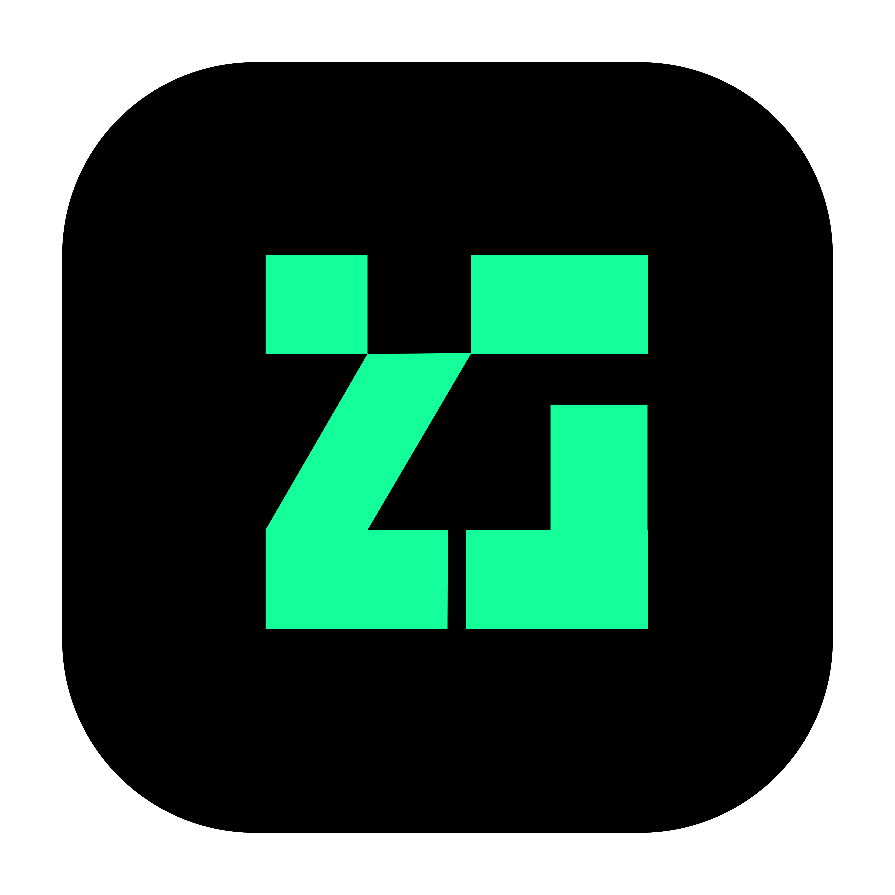
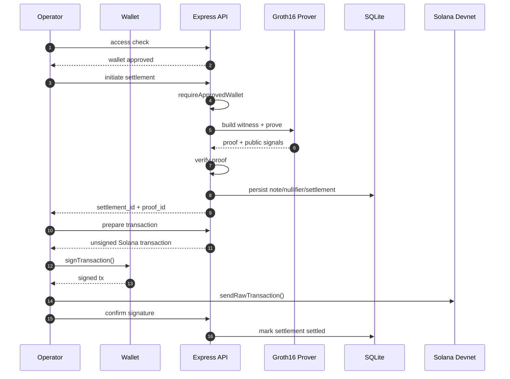
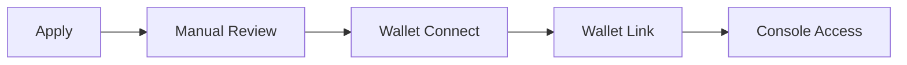

<div align="center">



# ZKGent

### Confidential payments, engineered for Solana.

Private by design. Verifiable by mathematics. Settled at Solana speed.

[](https://github.com/zkgent/ZKGent)
[](https://zkgent.sbs/trust-model)
[](https://explorer.solana.com/?cluster=devnet)
[](https://zkgent.sbs/apply)

[Website](https://zkgent.sbs) · [Docs](https://zkgent.sbs/docs) · [Trust Model](https://zkgent.sbs/trust-model) · [Request Access](https://zkgent.sbs/apply)

<a href="https://x.com/zkgent"></a>
<a href="https://github.com/zkgent/ZKGent"></a>
<a href="https://t.me/zkgent"></a>

</div>

---

## The Pitch

**ZKGent** is a confidential payments operating layer for teams that want the settlement guarantees of Solana without the transparency costs of public transaction data.

It combines:

- a polished operator console
- a real Groth16 proving pipeline
- a wallet-aware access model
- a verifiable settlement path on Solana devnet
- a transparent roadmap from trusted alpha to stronger cryptographic enforcement

In short: **institutional-grade privacy UX, built on verifiable cryptographic rails**.

---

## Why this matters

Most blockchains make settlement easy and discretion impossible.
Payment size, timing, counterparties, and behavior leak by default.
For serious operators, that is not a feature. It is exposure.

ZKGent exists to make private financial operations feel first-class, not improvised.

---

## What makes ZKGent different

| Dimension               | ZKGent approach                                                       |
| ----------------------- | --------------------------------------------------------------------- |
| **Privacy**             | Confidential transfer flow built around ZK commitments and nullifiers |
| **Proof system**        | Real Groth16 pipeline, not placeholder privacy branding               |
| **Operator experience** | Full console, not just protocol primitives                            |
| **Transparency**        | Trust assumptions disclosed in plain language                         |
| **Settlement**          | Solana-native path already integrated in alpha                        |
| **Roadmap**             | Clear D1 → D2 → D3 progression                                        |

---

## Honest framing

ZKGent is currently in **Devnet Alpha** under a **D1 operator-trusted** model.
That means the cryptography is real, while some state and operational assumptions remain off-chain and operator-held.

| Real today                                           | Still trusted in D1                                         |
| ---------------------------------------------------- | ----------------------------------------------------------- |
| Real Groth16 zk-SNARK transfer circuit (~5,914 R1CS) | Operator can still see plaintext during server-side proving |
| BN254 + Poseidon + snarkjs verification              | Operator-held note encryption keys                          |
| Solana devnet anchoring via SPL Memo                 | Off-chain Merkle and nullifier state                        |
| Public proof re-verification endpoint                | Single-party phase-2 ceremony                               |
| Invitation-only wallet-gated console                 | Unsigned wallet header for cohort gating                    |

> **No mainnet support yet. Do not use real funds.**

We would rather look slightly less flashy than pretend the trust model is stronger than it is.

---

## Product surface

ZKGent is designed as a real operator workspace.

| Surface                | Role                                             |
| ---------------------- | ------------------------------------------------ |
| **Transfers**          | Confidential one-off settlements                 |
| **Payroll**            | Private multi-recipient payout flows             |
| **Treasury**           | Internal movement and routing of funds           |
| **Counterparties**     | Private directory and relationship layer         |
| **Activity**           | Append-only operational audit feed               |
| **Dashboard**          | Network, stack, and settlement observability     |
| **Docs + Trust Pages** | Public-facing transparency and technical clarity |

### Intended users

- fintech operators
- treasury teams
- OTC desks
- payroll infrastructure teams
- high-sensitivity payment products

---

## Architecture

```mermaid
flowchart TB
    subgraph Browser["Browser · React 19 + TanStack Router"]
        UI[Operator Console]
        Wallet[Solana Wallet]
        Gate[Access Gate + Trust Banner]
    end

    subgraph Server["Express API"]
        Access[/api/access/*]
        Apps[/api/applications/*]
        ZK[/api/zk/*]
        Auth[Approved Wallet Middleware]
    end

    subgraph Domain["ZK + Settlement Domain"]
        Prover[Groth16 Prover]
        Verify[snarkjs Verification]
        Settle[Settlement Orchestrator]
        Solana[@solana/web3.js Adapter]
    end

    subgraph Storage["SQLite"]
        A[(applications)]
        N[(notes / commitments / nullifiers)]
        S[(settlements / transfers)]
        E[(activity events)]
    end

    subgraph Chain["Solana Devnet"]
        Memo[SPL Memo Program]
    end

    UI --> Gate --> Access
    UI --> Wallet
    UI --> ZK
    Access --> A
    Apps --> A
    ZK --> Auth --> Prover --> Verify --> Settle
    Settle --> N
    Settle --> S
    Settle --> E
    Settle --> Solana --> Memo
```

---

## How a confidential transfer works



---

## Proof points

### Cryptography

- **Groth16 zk-SNARK proving** via `snarkjs`
- **BN254** field arithmetic
- **Poseidon** hashing for commitment-friendly circuits
- **Public proof verification** endpoint for independent review
- **Explicit separation** between D1 trust and future D2/D3 guarantees

### Product engineering

- **React 19** + **TanStack Router** frontend
- **Express 5** application surface
- **SQLite + better-sqlite3** operational persistence
- **Wallet-aware access control** for alpha cohort management
- **Admin review flow** for application approval and wallet linking

### Settlement path

- **Solana devnet anchoring** through SPL Memo
- **Prepared transaction flow** for real wallet signing
- **Proof-aware lifecycle** from witness creation to anchored settlement

---

## Integrations

ZKGent sits on top of a focused set of high-signal building blocks.

| Integration                 | Logo                                                                                                           | Role                                | Status    |
| --------------------------- | -------------------------------------------------------------------------------------------------------------- | ----------------------------------- | --------- |
| **Solana**                  |                          | Settlement network                  | Active    |
| **@solana/web3.js**         |                     | Transaction building and submission | Active    |
| **Phantom**                 |                      | Wallet connection and signing       | Supported |
| **Backpack**                |                                        | Wallet connection and signing       | Supported |
| **Solflare**                |                                        | Wallet connection and signing       | Supported |
| **snarkjs**                 |  | Groth16 proving and verification    | Active    |
| **circomlib / circomlibjs** |             | Circuit-friendly primitives         | Active    |
| **Noble**                   |     | Curves, hashes, signature utilities | Active    |
| **SPL Memo Program**        |                        | On-chain devnet anchoring           | Active    |
| **Hermez Phase-1 Ceremony** | 🔒                                                                                                             | Universal powers of tau source      | Inherited |

### Integration philosophy

We prefer a smaller, more credible stack over a flashy but fragile one.
Every integration in this repo has a concrete role in either proving, settlement, wallet interaction, or operator trust.

---

## Integration badges

<p>
  
  
  
  
  
  
  
  
</p>

---

## Quickstart

### Prerequisites

- Node.js 20+
- npm
- Solana wallet extension for UI testing

### Run locally

```bash
npm install
npm run api
npm run dev
```

- frontend: `http://localhost:5000`
- API: `http://localhost:3001`

Local SQLite data is stored outside the repo root by default at `.local/data/zkgent.db`.
Override with `ZKGENT_DB_PATH` or `ZKGENT_DATA_DIR` if needed.

### Useful commands

```bash
npm run build
npm run lint
npm run format
npm start
```

### Important environment variables

| Variable               | Purpose                        |
| ---------------------- | ------------------------------ |
| `ADMIN_KEY`            | Admin panel authentication     |
| `SOLANA_NETWORK`       | Use `devnet` for current alpha |
| `SOLANA_RPC_URL`       | Optional custom RPC endpoint   |
| `ZKGENT_OPERATOR_SEED` | Operator signing seed          |

> Always confirm you are targeting **devnet**, not mainnet.

---

## Access model

ZKGent is invitation-only during this phase.
Access exists to protect the alpha cohort and make sure users understand the current trust model before operating the system.



### Current flow

1. apply for access
2. complete manual review
3. connect a Solana wallet
4. link wallet to the approved application
5. unlock the operator console

---

## API snapshot

Full docs live at **[zkgent.sbs/docs/api](https://zkgent.sbs/docs/api)**.

### Public

```http
POST /api/applications
GET  /api/applications/:id
GET  /api/access/check?wallet=ADDRESS
POST /api/access/link-wallet
```

### Wallet-gated

```http
POST /api/zk/settlement/initiate
POST /api/zk/tx/prepare
POST /api/zk/tx/confirm
```

### Public verification and observability

```http
GET /api/zk/proofs/:id/verify
GET /api/zk/system
GET /api/zk/solana
GET /api/zk/keys
GET /api/zk/disclosure
```

---

## Trust model roadmap

| Phase  | State       | Meaning                                                |
| ------ | ----------- | ------------------------------------------------------ |
| **D1** | current     | real ZK, operator-trusted, devnet alpha                |
| **D2** | in progress | client-side proving, operator no longer sees plaintext |
| **D3** | planned     | on-chain verifier, stronger enforcement, mainnet path  |

Further reading:

- [Trust Model](https://zkgent.sbs/trust-model)
- [Docs: Trust](https://zkgent.sbs/docs/trust)

---

## Design principles

ZKGent is being built around a few non-negotiables:

- **privacy should feel premium, not obscure**
- **trust assumptions must be disclosed, not hidden**
- **operator UX matters as much as protocol design**
- **verifiability is a product feature, not a footnote**
- **serious infrastructure should look serious**

---

## Security and disclosure

If you discover a vulnerability, report it privately first.
Do not open a public issue for anything that weakens privacy, settlement integrity, wallet gating, key handling, or proof correctness.

We welcome serious review. We do not reward careless disclosure.

---

## Community

- Website: [zkgent.sbs](https://zkgent.sbs)
- Docs: [zkgent.sbs/docs](https://zkgent.sbs/docs)
- X: [x.com/zkgent](https://x.com/zkgent)
- Telegram: [t.me/zkgent](https://t.me/zkgent)
- GitHub: [github.com/zkgent/ZKGent](https://github.com/zkgent/ZKGent)

---

## License

This project is licensed under the **MIT License**.
See [LICENSE](./LICENSE) for details.

---

<div align="center">

**ZKGent**

Private by design. Verifiable by mathematics. Settled at Solana speed.

</div>
