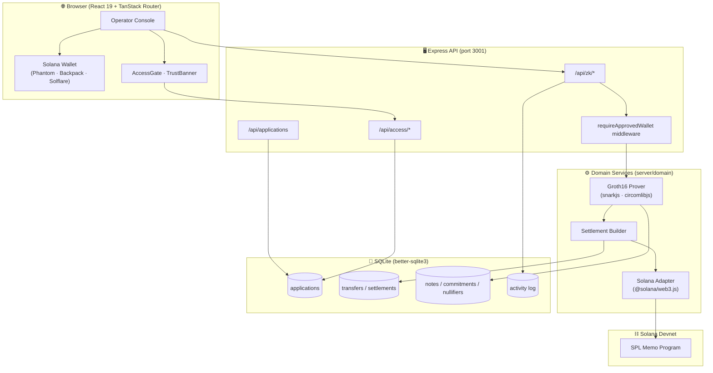
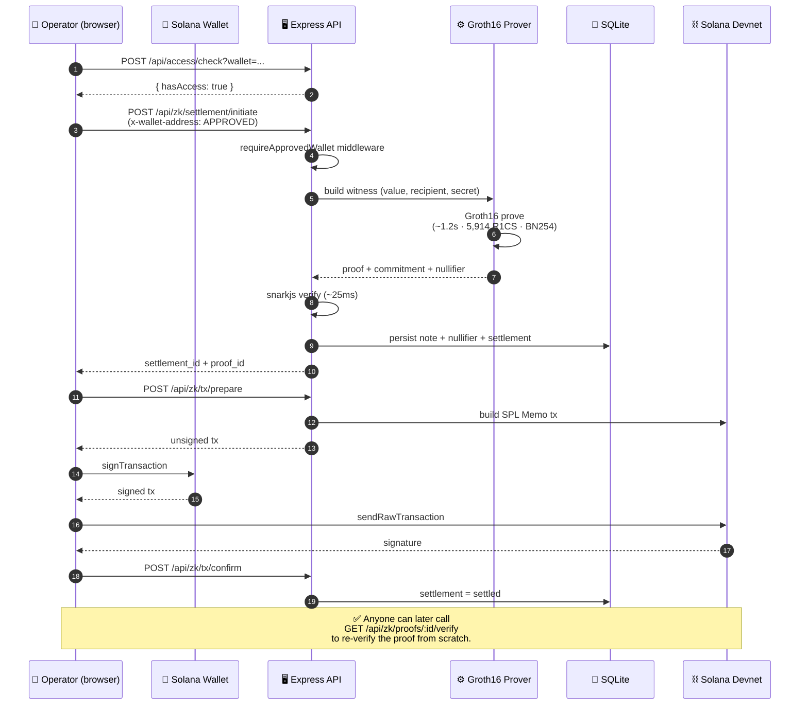
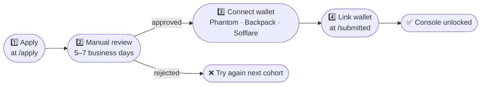
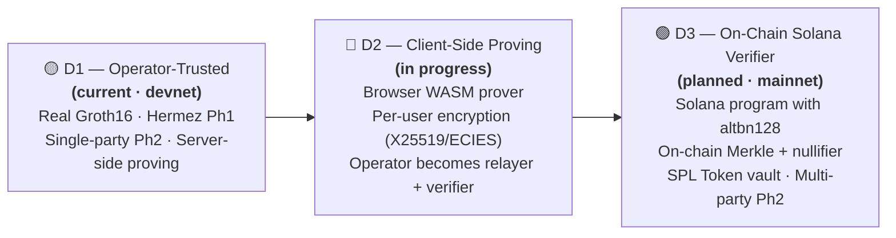
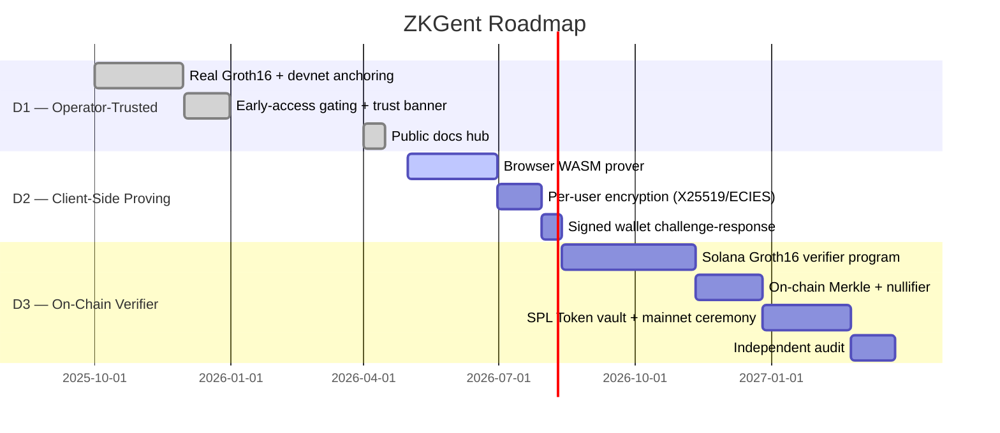

<div align="center">


# ZKGent

**Confidential payments, engineered for Solana.**
Private by design. Verifiable by mathematics. Settled at Solana speed.

[](https://github.com/zkgent/ZKGent)
[](./src/routes/trust-model.tsx)
[](https://explorer.solana.com/?cluster=devnet)
[](#-getting-access)
[](#-license)

[Website](https://zkgent.replit.app) · [Docs](https://zkgent.replit.app/docs) · [Trust Model](https://zkgent.replit.app/trust-model) · [Apply for Access](https://zkgent.replit.app/apply)

<a href="https://x.com/zkgent"></a>
<a href="https://github.com/zkgent/ZKGent"></a>
<a href="https://t.me/zkgent"></a>

</div>

---

## ⚠️ Honest framing first

ZKGent is currently in **Devnet Alpha (D1 — Operator-Trusted)**. We are publishing in the open with the trust model on the front page so you can decide before you sign up.

| What is real today | What is still trusted |
|---|---|
| ✅ Real Groth16 zk-SNARK transfer circuit (~5,914 R1CS) | ⚠️ Operator can see plaintext (server-side proving) |
| ✅ BN254 curve, Poseidon hashing, snarkjs verification | ⚠️ Operator-held note encryption keys |
| ✅ Phase-1 trusted setup from public Hermez ceremony (140+ contributors) | ⚠️ Off-chain Merkle / nullifier state |
| ✅ Solana devnet anchoring via SPL Memo | ⚠️ Phase-2 ceremony is single-party (devnet only) |
| ✅ Independent re-verification of every proof | ⚠️ Wallet header is unsigned (D1 cohort gate) |

> 🚫 **No mainnet support. Do not deposit real funds.** Real-fund support arrives with D3.

Full trust roadmap → **[D1 → D2 → D3](#-trust-model)**

---

## 📖 Table of Contents

- [What is ZKGent?](#-what-is-zkgent)
- [Architecture](#-architecture)
- [How a Confidential Transfer Works](#-how-a-confidential-transfer-works)
- [Tech Stack](#-tech-stack)
- [Integrations](#-integrations)
- [Quickstart (Developers)](#-quickstart-developers)
- [Getting Access (Operators)](#-getting-access)
- [API Overview](#-api-overview)
- [Trust Model](#-trust-model)
- [Project Structure](#-project-structure)
- [Roadmap](#-roadmap)
- [Security & Disclosure](#-security--disclosure)
- [Community](#-community)
- [License](#-license)

---

## 🌐 What is ZKGent?

**ZKGent** is an operator workspace for sending and managing confidential payments on Solana. Transfer values, recipients, and metadata are hidden inside zero-knowledge commitments, while settlements are anchored on Solana so anyone can verify that they happened — without seeing what they were.

### The console covers the full payment lifecycle

| Module | What it does |
|---|---|
| 💸 **Transfers** | Ad-hoc confidential transfers with proof + on-chain anchoring |
| 📅 **Payroll** | Bundled recurring payouts to N recipients |
| 🏦 **Treasury** | Named flows between internal accounts |
| 👥 **Counterparties** | Address book with private commitments |
| 📊 **Activity** | Append-only audit feed across every action |
| 📈 **Dashboard** | Stack status, recent settlements, Solana network |

### Who it's for

Payment operators · fintech teams · OTC desks · payroll providers — anyone who needs to move value on a public chain without leaking commercial details to the entire world.

---

## 🏛 Architecture



---

## 🔐 How a Confidential Transfer Works



---

## 🛠 Tech Stack

### Frontend

<p>
  <a href="https://react.dev"></a>
  <a href="https://www.typescriptlang.org"></a>
  <a href="https://vitejs.dev"></a>
  <a href="https://tanstack.com/router"></a>
  <a href="https://tailwindcss.com"></a>
  <a href="https://www.framer.com/motion/"></a>
  <a href="https://www.radix-ui.com"></a>
</p>

### Backend

<p>
  <a href="https://nodejs.org"></a>
  <a href="https://expressjs.com"></a>
  <a href="https://www.sqlite.org"></a>
  <a href="https://github.com/WiseLibs/better-sqlite3"></a>
  <a href="https://zod.dev"></a>
</p>

### Cryptography

<p>
  <a href="https://github.com/iden3/snarkjs"></a>
  <a href="https://github.com/iden3/circomlib"></a>
  <a href="https://github.com/paulmillr/noble"></a>
</p>

### Blockchain

<p>
  <a href="https://solana.com"></a>
  <a href="https://solana-labs.github.io/solana-web3.js/"></a>
</p>

---

## 🔌 Integrations

| Integration | Logo | Purpose | Status |
|---|---|---|---|
| [**Solana**](https://solana.com) |  | L1 settlement layer (devnet) | ✅ Active |
| [**Phantom**](https://phantom.app) |  | Solana wallet | ✅ Supported |
| [**Backpack**](https://backpack.app) |  | Solana wallet | ✅ Supported |
| [**Solflare**](https://solflare.com) |  | Solana wallet | ✅ Supported |
| [**SPL Memo Program**](https://spl.solana.com/memo) |  | On-chain anchoring | ✅ Active |
| [**Hermez Phase-1 Ceremony**](https://github.com/iden3/snarkjs#7-prepare-phase-2) | 🔒 | Universal trusted setup (140+ contributors) | ✅ Inherited |
| [**Solana Explorer**](https://explorer.solana.com/?cluster=devnet) |  | Settlement verification UI | ✅ Linked |

> 🔭 **Planned (D2 / D3):** Light Protocol altbn128 syscalls (on-chain Groth16 verifier), SPL Token vault, browser WASM prover, multi-party Phase-2 ceremony, official audit partner.

---

## 🚀 Quickstart (Developers)

### Prerequisites

- **Node.js** ≥ 20
- **npm** (project uses npm; pnpm/yarn not configured)
- A modern browser with a **Solana wallet** extension (devnet)

### Install & run

```bash
# 1. Install dependencies
npm install

# 2. Run API server (port 3001) and Vite dev (port 5000) in two terminals
npm run api      # Express + tsx watch
npm run dev      # Vite dev server (proxies /api → :3001)
```

The dev server is at **http://localhost:5000**. The API is at **http://localhost:3001**.

### Environment variables

| Variable | Default | Purpose |
|---|---|---|
| `ADMIN_KEY` | `zkgent-admin-dev` | Admin panel auth (`/admin/applications`) |
| `SOLANA_NETWORK` | `mainnet-beta` | ⚠️ **Set to `devnet`** for D1 / current safe target |
| `SOLANA_RPC_URL` | (default cluster URL) | Override the RPC endpoint |
| `ZKGENT_OPERATOR_SEED` | _required for prod_ | Operator signing seed (env-only, never committed) |

> ⚠️ Always verify `SOLANA_NETWORK=devnet` before connecting any wallet. ZKGent is **not production-ready for mainnet** during D1.

### Useful commands

```bash
npm run build       # Production frontend build
npm run lint        # ESLint
npm run format      # Prettier
npm start           # Run API in production mode
```

---

## 🎫 Getting Access

ZKGent is **invitation-only** during D1. The product surface is gated by an approved early-access application linked to a Solana wallet.



| Step | Where | What |
|---|---|---|
| 1 | [`/apply`](https://zkgent.replit.app/apply) | 4-step form: team, use case, sensitivity, optional wallet |
| 2 | _(handled by core team)_ | Manual review by humans, no automation |
| 3 | Wallet extension | Connect a **devnet** Solana wallet |
| 4 | [`/submitted`](https://zkgent.replit.app/submitted) | Link wallet ↔ application (one-to-one, atomic) |
| 5 | `/dashboard` and onward | Full operator workspace |

---

## 📡 API Overview

Full reference at [`/docs/api`](https://zkgent.replit.app/docs/api). Highlights:

### Public

```http
POST   /api/applications                  # Submit early-access application
GET    /api/applications/:id              # Read status
GET    /api/access/check?wallet=ADDRESS   # Does this wallet have access?
POST   /api/access/link-wallet            # Link wallet ↔ application (atomic)
```

### ZK & Settlement (wallet-gated, header `x-wallet-address`)

```http
POST   /api/zk/settlement/initiate        # Queue confidential settlement
POST   /api/zk/tx/prepare                 # Build unsigned Solana tx
POST   /api/zk/tx/confirm                 # Submit signed tx signature
```

### Public verification

```http
GET    /api/zk/proofs/:id/verify          # Re-verify ANY proof (no DB trust)
GET    /api/zk/keys                       # Public key fingerprints
GET    /api/zk/system                     # Cryptographic stack status
GET    /api/zk/solana                     # Live devnet status + operator balance
GET    /api/zk/disclosure                 # Selective disclosure mechanism
```

### Error codes

| Code | Error | Meaning |
|---|---|---|
| `400` | `wallet_mismatch` | Header wallet differs from body wallet |
| `401` | `wallet_required` | Gated endpoint called without wallet header/body |
| `403` | `access_denied` | Wallet has no approved application |
| `404` | `application_not_found` / `settlement_not_found` | — |
| `409` | `wallet_already_linked_to_another_application` | UNIQUE constraint hit |

---

## 🛡 Trust Model

> Confidential systems are only as strong as the assumptions you understand. We publish ours in plain language.



| Phase | Network | Operator can see plaintext? | On-chain enforcement? | Real funds? |
|---|---|---|---|---|
| **D1 (now)** | Devnet | ⚠️ Yes | ❌ No | ❌ No |
| **D2 (next)** | Devnet | ✅ No | ❌ No | ❌ No |
| **D3 (planned)** | Mainnet | ✅ No | ✅ Yes | ✅ Yes |

Full breakdown → [`/docs/trust`](https://zkgent.replit.app/docs/trust) and [`/trust-model`](https://zkgent.replit.app/trust-model).

---

## 📁 Project Structure

```text
ZKGent/
├── public/
│   └── logo.png                      # Brand logo
├── server/                           # Express API
│   ├── index.ts                      # API entry point (port 3001)
│   ├── db.ts                         # SQLite schema + helpers
│   ├── routes/
│   │   ├── access.ts                 # Wallet gating + middleware
│   │   ├── applications.ts           # Early-access applications
│   │   ├── zk.ts                     # ZK proofs + settlements
│   │   └── admin.ts                  # Admin panel API
│   └── domain/                       # Domain services
│       ├── prover.ts                 # Groth16 prove + verify
│       ├── solana.ts                 # @solana/web3.js adapter
│       └── settlement.ts             # Settlement orchestration
├── src/                              # React 19 SPA
│   ├── routes/                       # TanStack file-based routes
│   │   ├── index.tsx                 # Marketing landing
│   │   ├── trust-model.tsx           # D1/D2/D3 transparency page
│   │   ├── apply.tsx · submitted.tsx # Early-access flow
│   │   ├── docs/                     # Public docs hub
│   │   ├── dashboard.tsx · transfers.tsx · payroll.tsx
│   │   ├── treasury.tsx · counterparties.tsx · activity.tsx
│   │   └── admin/applications.tsx    # Admin (key-gated)
│   ├── components/
│   │   ├── zkgent/                   # Marketing components
│   │   ├── app/                      # Console: AccessGate, TrustBanner, AppShell
│   │   ├── docs/DocsLayout.tsx       # Docs sidebar + primitives
│   │   └── ui/                       # Shadcn / Radix primitives
│   └── hooks/
│       ├── useAccess.ts              # Wallet → access check
│       └── useWallet.ts              # Solana wallet adapter
├── replit.md                         # Project memory (architecture notes)
└── README.md                         # ← you are here
```

---

## 🗺 Roadmap



---

## 🔒 Security & Disclosure

If you find a security issue — circuit bug, server vulnerability, key handling problem, or anything that compromises the trust model — please report it **privately first**:

- **Do not** open a public GitHub issue
- **Do not** post on social media
- Email the core team and allow reasonable time for a fix before any public disclosure

We are pre-D2 and pre-audit; we welcome scrutiny and will credit responsible disclosures.

---

## 💬 Community

<p align="center">
  <a href="https://x.com/zkgent">
    
  </a>
  <a href="https://github.com/zkgent/ZKGent">
    
  </a>
  <a href="https://t.me/zkgent">
    
  </a>
</p>

<p align="center">
  <strong>Website:</strong> <a href="https://zkgent.replit.app">zkgent.replit.app</a> ·
  <strong>Docs:</strong> <a href="https://zkgent.replit.app/docs">/docs</a> ·
  <strong>Trust:</strong> <a href="https://zkgent.replit.app/trust-model">/trust-model</a> ·
  <strong>Apply:</strong> <a href="https://zkgent.replit.app/apply">/apply</a>
</p>

---

## 📜 License

**Source-available** during D1 / D2. The ZK pipeline (circuit, prover scripts, verifier) is intended to be open-sourced as it stabilizes; server-side operator code remains source-available pending the D2 architecture changes that move proving to the client.

A formal OSI license will be assigned no later than the D3 / mainnet milestone.

---

<div align="center">

**ZKGent** · Built honestly in the open.
Private by design. Verifiable by mathematics. Settled at Solana speed.

<sub>© 2026 ZKGent Labs · All rights reserved</sub>

</div>
